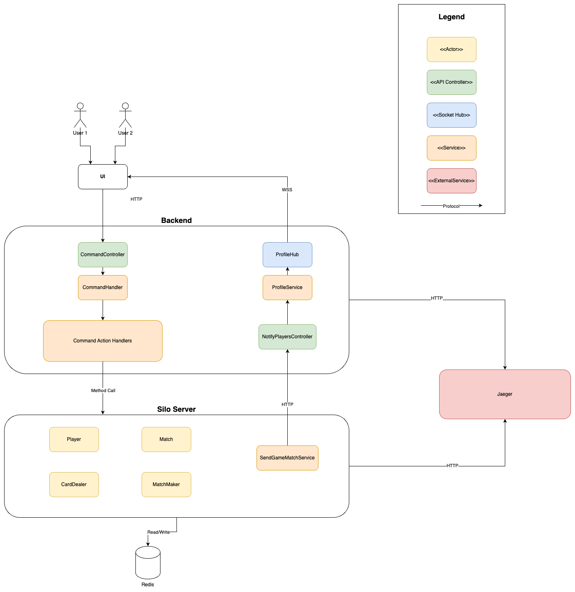

# Schnauz
A multiplayer card game implemented using the Actor Model with Orleans. Check out the following link to learn more about the game: [Schnauz](https://en.wikipedia.org/wiki/Schwimmen).


## Prerequisites

- [Docker](https://www.docker.com/products/docker-desktop)
- [.NET SDK 8.0](https://dotnet.microsoft.com/download/dotnet/8.0)

## Getting Started

1. Open a terminal.
2. Start redis and jaeger with docker-compose:

    ```sh
    docker-compose up
    ```
3. Restore the dependencies:

    ```sh
    dotnet restore
    ```

4. Run the applications (Silo Server and Server). Run the following commands in separate terminals:

    ```sh
    dotnet run --project Schnauz.Silo
    dotnet run --launch-profile "https" --project Schnauz.Server
    ```
   
You can choose to run the application without https by using the "http" launch profile.

## Project Structure

- `Schnauz.Server`: The main server-side project, which includes the Frontend, Backend and Grain Client.
- `Schnauz.Client`: The frontend.
- `Schnauz.Shared`: Shared components and utilities between frontend, backend and silo.
- `Schnauz.Grains`: The Grain implementations.
- `Schnauz.GrainInterfaces`: The interfaces for the Grains.
- `Schnauz.Silo`: The Silo Server.

## System Architecture



## Actor Model Architecture


## Architectural Decisions

### Use Match grain and CardDealer grain

#### Context and Problem Statement
The Match grain is responsible for managing the game state. It could be responsible for dealing cards as well.
However, the Match grain could become too complex if it is responsible for dealing cards.
How should the grains be designed to reflect this relationship?

#### Considered Options

* Use the Match grain to deal cards.
* Use a separate CardDealer grain to deal cards.
* Use the Match grain to deal cards, but delegate the task to a CardDealer grain.

#### Decision Outcome

Chosen option: Use a separate CardDealer grain to deal cards.

### Same Grain ID of Match and CardDealer

#### Context and Problem Statement

The Match and CardDealer grains have a one-to-one relationship. 
The Match grain is responsible for managing the game state, while the CardDealer grain is responsible for dealing cards. 
The CardDealer grain is only used by the Match grain.
How should the grains be designed to reflect this relationship?

#### Considered Options

* Use the same Grain ID for both grains.
* Use different Grain IDs for both grains. Store the CardDealer grain ID in the Match grain and vice versa.

#### Decision Outcome

Chosen option: Use the same Grain ID for both grains.

### Communication from Grain to Client

#### Context and Problem Statement

The Match grain needs to communicate with the server to update the game state.
How should the Match grain communicate with the server?

#### Considered Options

* Use the SignalR library to communicate with the server.
* Use an HTTP client and an API Endpoint on the server for communication.
* Use Orleans Streams to communicate with the server.

#### Decision Outcome

Chosen option: Use an HTTP client and an API Endpoint on the server for communication.


## Challenges during the Project
### Deadlocks through circular calls of grains
The first challenge we faced was the circular calls of grains. 
We had a situation where a grain would call another grain, which would call the first grain again. 
This caused a deadlock as the first grain was already locked by the first call.

### Action call from the server to the grain
The Actor Model describes that actors should be passive and only react to messages.
However, the question arose of which actor should be called when a player makes a move.
Should each action been initiated by the player actor?
We decided to call the appropriate actor from the server that is responsible for the action itself.

### Domain Logic on Server or Grain
The question arose of where the domain logic should be implemented.
Of course, the most important thing is that the domain logic should be implemented in the grain, but 
the question arose of whether the server should also have domain logic.
We decided to implement the domain logic in the grain and only use the server for communication.
But we also implemented some domain logic on the server side to validate the game state.


## Future Work
* Implement authentication and authorization for the API.
* Don't use the username as the primary key for the user. Use a GUID instead.
* Use REST Pattern for the API.
* Use a backup provider for the storage provider.
* Follow Clean Architecture by separating DTOs, Domain Objects and Entities.
* Feature ideas:
   * Implement a group chat.
   * Implement a friend system.
   * Implement a global ranking system.
